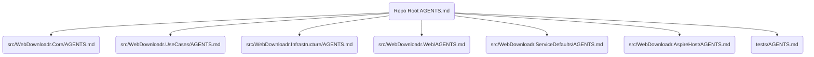

# AGENTS.md

> **Purpose**  
> This document defines project structure, contribution rules, and technical policies for both human contributors 🧑 and AI agents 🤖 in this repository.
> - **Human developers:** Focus on sections marked 🧑
> - **AI agents:** Follow all items marked 🤖 and the “AI Agent Rules” section
>
> **Note:** If you update this document, review related files in `/docs/` and CI configs for consistency.

---

## Table of Contents

1. [Project Structure and Layering](#1-project-structure-and-layering)
2. [Contribution Workflow 🧑](#2-contribution-workflow-)
3. [AI Agent Rules 🤖](#3-ai-agent-rules-)
4. [Layer Inheritance & Overrides](#4-layer-inheritance--overrides)
5. [Quality Gates, Formatting, Linting](#5-quality-gates-formatting-linting)
6. [Examples & Patterns](#6-examples--patterns)
7. [Repository Rules Reference](#7-repository-rules-reference)
8. [Maintenance & Contacts](#8-maintenance--contacts)
9. [Appendices](#9-appendices)

---

## 1. Project Structure and Layering

This repository uses a layered architecture for maintainability, clear separation of concerns, and testability. See the table below for a summary of each layer and its allowed dependencies.

| Layer               | Folder                             | Brief description                                                                                                                                                                                                                                                                                                        |
|---------------------|------------------------------------|--------------------------------------------------------------------------------------------------------------------------------------------------------------------------------------------------------------------------------------------------------------------------------------------------------------------------|
| **Core**            | `src/WebDownloadr.Core`            | Domain entities, value objects, domain events, and interfaces—**no external dependencies** except [`Ardalis.GuardClauses`](https://github.com/ardalis/GuardClauses) & [`Ardalis.Specification`](https://github.com/ardalis/Specification).                                       |
| **UseCases**        | `src/WebDownloadr.UseCases`        | CQRS command/query handlers, request/response DTOs, validators, and pipeline behaviors. Has a project reference only to **Core** and may use external packages but must not depend on **Infrastructure** or **Web**.                                                             |
| **Infrastructure**  | `src/WebDownloadr.Infrastructure`  | Contains EF Core `DbContext`, external service adapters, and persistence implementations. These align with Core interfaces and reside under the `Data/` folder.                                                                             |
| **Web**             | `src/WebDownloadr.Web`             | HTTP API using [FastEndpoints 6](https://fast-endpoints.com/docs/introduction); hosts application services. Depends on **UseCases**, **Infrastructure**, and **ServiceDefaults**. Except for dependency-injection wiring in `Program.cs`, Web code must call Infrastructure **only via interfaces or UseCase handlers**. |
| **ServiceDefaults** | `src/WebDownloadr.ServiceDefaults` | Shared startup & telemetry helpers for [.NET Aspire](https://learn.microsoft.com/en-us/dotnet/aspire/) and cloud hosting.                                                                                                                  |
| **AspireHost**      | `src/WebDownloadr.AspireHost`      | Runs the Web project when using .NET Aspire (optional preview in .NET 9).                                                                                                                           |
| **Tests**           | `tests/*`                          | `Unit`, `Integration`, `Functional`, and `Aspire` test projects mirroring the structure above. For every new or modified feature in `src/`, a corresponding test must be added or updated in `tests/`.                                     |

> **WARNING:**
> - Do NOT introduce dependencies from lower layers to higher layers.
> - Adapters should only point downwards.
> - See [Section 7](#7-repository-rules-reference) for the canonical dependency rules.

---

## 2. Contribution Workflow 🧑

- Fork and branch from `main` or the latest release branch.
- Use feature branches named as `feature/<brief-description>`, fixes as `fix/<brief-description>`, etc.
- Follow **Conventional Commits** for all messages (see [Section 7.3](#73-commit--pr-standards)).
- Run all tests and linters before opening a PR.
- Reference issues and use clear, descriptive PR titles.
- Add/update documentation and examples as needed (see [Section 7.4](#74-coding--documentation-standards)).

---

## 3. AI Agent Rules 🤖

- **Stepwise Reasoning:** Output chain-of-thought reasoning for all non-trivial tasks.
- **Self-Validation:** AI agents must check outputs against these rules before proposing changes.
- **Escalation:** If a rule is ambiguous or cannot be enforced, escalate via a GitHub Issue or tag a maintainer for review.
- **Output Format:** All code, config, and documentation output by AI agents must be in valid, ready-to-commit format. Use the file block syntax specified by Copilot Spaces.
- **Prompt Engineering:** Avoid forbidden prompt styles (see [Appendix A](#appendix-a-forbidden-prompt-styles)).
- **Resource Limits:**
    - Max 5 HTTP calls/run
    - Max 512MB memory
    - Max 60s execution per task
- **Inheritance:** Respect local AGENTS.md overrides (see [Section 4](#4-layer-inheritance--overrides)).
- **Security:** Never leak secrets or PII in output.
- **Common Mistakes to Avoid:**
    - ❌ Proposing code that directly accesses the database from UseCases
    - ❌ Omitting test or documentation updates when logic changes
    - ❌ Suggesting changes to AGENTS.md in subfolders without inheriting from parent
    - ❌ Outputting non-deterministic or ambiguous code or text
    - ✅ Output stepwise reasoning for architectural decisions
    - ✅ Escalate to human review when uncertain

---

## 4. Layer Inheritance & Overrides

AGENTS.md may exist in any project/layer folder. The most specific (deepest) file overrides higher-level settings for that path. If a folder does not contain its own AGENTS.md, rules from the parent directory (or repo root) apply.



> For a list of current AGENTS.md override locations, see the folders above.

---

## 5. Quality Gates, Formatting, Linting

- **Scripts & Setup:**
    - For environment and dependency setup, see the scripts in [`/scripts`](./scripts):
        - `setup-codex.sh`: Codex environment setup.
        - `setup-dotnet.sh`: .NET 9 dependency setup.
        - `install-tools.sh`: Additional .NET 9 tool installation.
        - `archtest.sh`: Verify that architectural boundaries are enforced.
- **Tests:** All code must pass unit/integration tests (run via script or `dotnet test`).
- **Coverage:** PRs must not decrease overall coverage (see [`/ci/coverage.yml`](./ci/coverage.yml)).
- **Format:** Run `dotnet format` and `shfmt` for C# and Shell scripts, respectively.
- **Lint:** Use `commitlint` for commit messages and `eslint` for JavaScript.
- **CI/CD:** For full pre-commit and CI/CD configuration, see [`/ci/`](./ci/) and referenced scripts.
- **Automated Checks:**
    - All rules are enforced by pre-commit hooks, CI scripts, and architectural test scripts as described above.

---

## 6. Examples & Patterns

This repository follows [Ardalis Clean Architecture](https://github.com/ardalis/CleanArchitecture). Examples and patterns below illustrate common usage; refer to [Section 1](#1-project-structure-and-layering) for the canonical structure and dependency rules.

1. **CQRS (Command Query Responsibility Segregation):**
    - Commands: `src/WebDownloadr.UseCases/Commands/`
    - Queries: `src/WebDownloadr.UseCases/Queries/`
    - Pattern: Commands encapsulate writes; queries encapsulate reads. Both use the Mediator pattern to decouple sender and receiver.

2. **Domain Events:**
    - Events: `src/WebDownloadr.Core/DomainEvents/`
    - Handlers: `src/WebDownloadr.UseCases/EventHandlers/`
    - Pattern: Business rules enforced in the domain layer via events/handlers.

3. **Specification Pattern:**
    - Specs: `src/WebDownloadr.Core/Specifications/`
    - Usage: `src/WebDownloadr.Infrastructure/Data/Repositories/`
    - Pattern: Complex queries encapsulated as reusable specifications.

4. **Dependency Injection (DI):**
    - Setup: `src/WebDownloadr.Web/Program.cs`
    - Pattern: Use ASP.NET Core’s DI container for dependency resolution.

5. **Unit of Work and Repository:**
    - Repositories: `src/WebDownloadr.Infrastructure/Data/Repositories/`
    - Unit of Work: `src/WebDownloadr.Infrastructure/Data/UnitOfWork`
    - Pattern: Data access abstracted; transactions managed via Unit of Work.

6. **Adapters and Ports:**
    - Adapters: `src/WebDownloadr.Infrastructure/Data/Adapters/`
    - Ports: `src/WebDownloadr.Core/Interfaces/`
    - Pattern: Ports and Adapters isolates external dependencies from domain.

7. **API Endpoints:**
    - Endpoints: `src/WebDownloadr.Web/Endpoints/`
    - Pattern: [FastEndpoints](https://fast-endpoints.com/docs/introduction) exposes business logic from UseCases.

8. **Testing:**
    - Unit: `tests/WebDownloadr.UnitTests/`
    - Integration: `tests/WebDownloadr.IntegrationTests/`
    - Functional: `tests/WebDownloadr.FunctionalTests/`
    - Pattern: All new/modified code must be covered by tests.

#### Example: AI Agent PR Output
- PR Title: `feat: add download domain event and handler`
- Commit Message:
  ```
  feat(core): add DownloadCompleted domain event

  - Adds DownloadCompleted domain event to Core
  - Implements handler in UseCases
  - Updates tests for new event logic

  Closes #123
  ```

> For layer/project-specific examples and overrides, see the relevant AGENTS.md in each project directory (see [Section 4](#4-layer-inheritance--overrides)).

---

## 7. Repository Rules Reference

### 7.1. Dependency & Import Rules
- Only reference and import from your own layer and lower.
    - See [Section 1](#1-project-structure-and-layering) and [Section 4](#4-layer-inheritance--overrides).
    - **Forbidden:** Upwards or lateral imports (e.g., Web importing from Infrastructure, UseCases referencing Web).
    - **External packages:** Allowed only if justified in your layer’s AGENTS.md or Core documentation.
- Cyclic dependencies are strictly prohibited.
    - Enforced with [`archtest.sh`](./scripts/archtest.sh) and architectural test suites.

### 7.2. Naming Conventions
- **Classes & Types:** `PascalCase` (e.g., `DownloadRequestHandler`)
- **Variables & Parameters:** `camelCase` (e.g., `downloadUrl`)
- **Files:**
    - C#: `PascalCase` (e.g., `UserService.cs`)
    - Scripts: `kebab-case.sh` (e.g., `setup-codex.sh`)
- **Branches:**
    - Features: `feature/<concise-description>`
    - Fixes: `fix/<concise-description>`
    - Docs: `docs/<concise-description>`

### 7.3. Commit & PR Standards
- **Commit messages:**
    - Use [Conventional Commits](https://www.conventionalcommits.org/) (`feat:`, `fix:`, `docs:`, etc.).
    - Reference issues where relevant.
- **PRs:**
    - PR titles should be descriptive and match commit conventions.
    - Reference related issues in the PR description.
- **Issue/PR templates:**
    - Use templates in [`.github/`](./.github/).
    - Fill out all required fields.

### 7.4. Coding & Documentation Standards
- All code changes must include or update corresponding tests in `/tests`.
- Update AGENTS.md files and `/docs` as needed for local overrides, new patterns, or significant changes.
- Follow test and documentation naming/structuring conventions.

### 7.5. Enforcement
- All rules above are enforced by scripts and CI described in [Section 5](#5-quality-gates-formatting-linting).
- PRs that fail checks will not be merged.

---

## 8. Maintenance & Contacts

- Update this file when process, structure, or patterns change.
- Major changes should be reviewed by at least one core maintainer.
- For questions, contact a core maintainer listed in [MAINTAINERS.md].

---

## 9. Appendices

### Appendix A: Forbidden Prompt Styles 🤖

- No open-ended “do anything” prompts.
- No request for code execution outside the prescribed CI/CD context.
- No speculative or non-deterministic answers.

### Appendix B: Glossary

- **CQRS:** Command Query Responsibility Segregation
- **DTO:** Data Transfer Object
- **Adapter:** A layer to interface with external systems
- **Override:** A local AGENTS.md or configuration that takes precedence over a parent by folder hierarchy
- **Escalation:** The process by which an AI agent requests human intervention or review
- **Codex:** The AI-enabled workflow environment in this repository

---

> **Reminder:** This file is the canonical reference for all structure, process, and AI agent behavior in this repository.